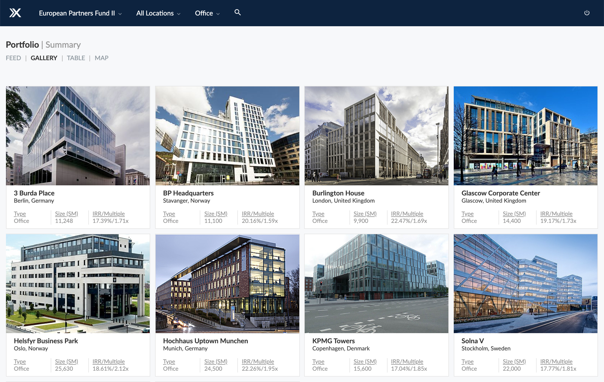

VmX is consolidating, streamlining and supercharging the management of
commercial real estate investment portfolios for the biggest firms in the
industry. Members of our team have managed _billions_ of dollars of commercial
real estate transactions, and we’re changing the way this $15 trillion
industry does business.

## The Platform

To this end we built the [VmX Platform](https://platform.verumex.com), the
definitive destination for real asset data. We primarily leverage Ruby on Rails
6 and ReactJS for our server and client logic respectively, and serve the
application via geographically distributed AWS hardware. See the
[Platform](/platform) section for more information.

## Company Origin

VmX was founded in 2018 by seasoned entrepreneurs and asset managers from
[Anvil Asset Advisors](https://www.anvil.no) and the leadership team at
[Lockstep Labs](https://github.com/lockstep). The first version of the platform
was released in Q2 of 2019, and we are currently hiring for engineering roles in
all three of our offices (Boulder, Chennai and Bangkok).
