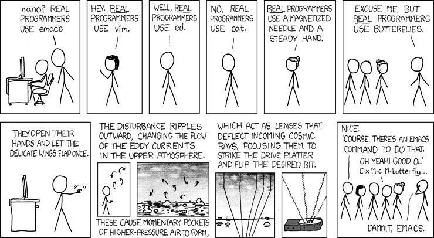

At VmX we're building a team comprised exclusively of seasoned, sophisticated
engineers. Our team members come from a wide range of backgrounds, but we all
agree that the most fun we've had as engineers is when we're working on
challenging problems surrounded by peers who are as dependable as they are
demanding.

If you are interested in a position at VmX, or are just curious to see how we do
things, you've come to the right place. We maintain this corner of the internet
for our fellow software and data enthusiasts to share ideas, best practices and
current thoughts on the state of software development and tooling. You'll find
some general information about the VmX platform itself, but our primary
objective is to share information across our engineering organization and help
prospective colleagues get to know us better. If you are looking for
documentation regarding information security, infrastructure or other
client-facing materials, get in touch with our client relations team as
those resources will be elsewhere.

Please kick back, grab a strongly caffeinated beverage and browse around. If you
like what you see, get in touch! We are actively hiring smart, motivated
software engineers and data scientists who aren't afraid of a challenge.

And by the by, this site is open source. See a typo or want to add something?
[Submit a pull request](https://github.com/Verumex/vmx_engineering)!

---

