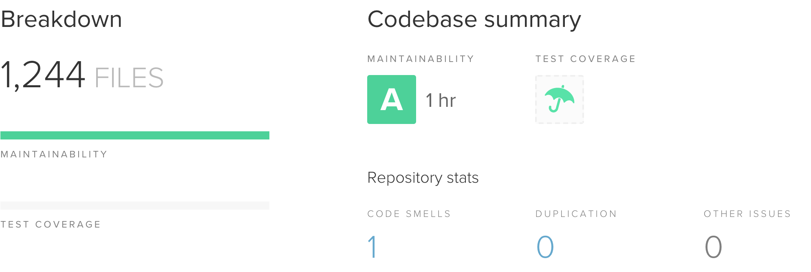

## Technology Stack

### Server

The VmX Platform is a highly conventional Ruby on Rails 6 application. The core
platform team from Lockstep developed a refined Rails development
paradigm over dozens of client projects, to include a boiler-plate
[template](https://github.com/lockstep/rails_new) with opinionated object
models/design patterns. The VmX team still contributes to that baseline
template and regularly merges updates from the template into the platform code.

### Client

A large majority of our views are server-rendered (leveraging Turbolinks to
improve the navigation experience). However, most sufficiently complex
applications benefit from JS-enabled interactions and VmX is no exception. We
use [Bootstrap 4](https://getbootstrap.com) components aggressively (most
Bootstrap features make an appearance at least once in the platform), and we
maintain a significant number of our own vanilla or jQuery-based components.

For implementations that require more complex interactions and state management
we use ReactJS, though React modules are kept to a minimum as their relatively
high levels of complexity can be hard to justify.

## Stats

*_Stats current as of October 2019_

### Line Count and Ratios

Excluding views and CSS the summary output from `rails stats` is:

|  Lines |    LOC | Classes | Methods |  M/C | LOC/M |
| -----: | -----: | ------: | ------: | ---: | ----: |
| 29,545 | 21,680 |     441 |    1611 |    3 |    11 |

- Code LOC: 14,530
- Test LOC: 7,150
- Code to Test Ratio: 1:0.5

### Test Suite

- Example Count: 446
- Average Non-parallel Runtime: 3:30
- Top 10 slowest examples: 37 seconds, 18% of total time

### Code Climate

## Tooling

- _CircleCI_ - Continuous Integration
- _Code Climate_ - Automated code quality reviews
- _RuboCop_ - Ruby linting
- _ESLint_ - JS linting
- _Webpack_ - Asset bundling and HMR in development
- _Bundler Audit_ - Dependency vulnerability detection
- _Brakeman_ - Static security vulnerability scanner
- _RSpec_ - Testing library
- _Bullet_ - Performance optimization

The platform is also Docker-ready for those who prefer local development with
Docker and in anticipation of more advanced orchestration requirements in the
future.
