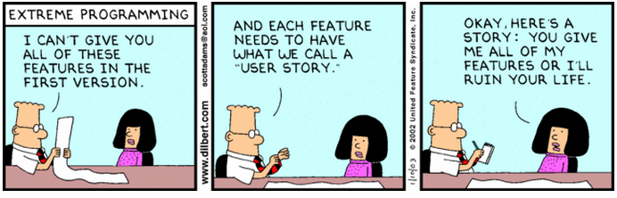

Over years of client projects at Lockstep we developed a robust
[Playbook](https://github.com/lockstep/playbook) that inevitably yielded
positive client outcomes and an efficient, productive work environment. Many
best practices and habits from that Playbook remain in effect at VmX today, so a
familiarity with the protocols outlined there will provide significant insight
into our day-to-day workflows and product management style at VmX.

That said, most of what we captured there can be boiled down to a combination
of good communication and earnestness that we call Loud
ProductivityTM. It is up to our leadership team to articulate
priorities and keep everyone informed as to product goals and optimal timelines,
but our engineering team has significant latitude to structure schedules and
work hours. Those who prefer rigorous management and daily guidance don't tend
to perform well in our self-paced environment, as too much freedom for some can
be more of a blessing than a curse.

We maintain that autonomy and flexibility by following rigorous ticket
management and PR conventions that enable everyone on the team to follow along
with progress, which means it is clear what everyone is working on at any given
time. While we loosely batch tickets into something resembling long sprints and
we discuss/tag complexity estimates in a way that vaguely resembles Agile
methodology, we believe a sufficiently small, competent and self-motivated
team does better with more flexibility and fewer planning meetings.

---

